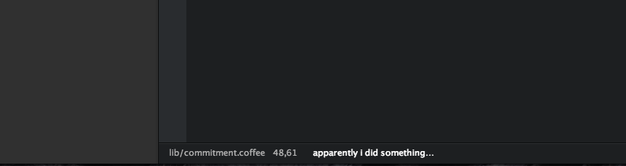

# commitment [![Build Status][travis-image]][travis-url]

> Atom adoption of the great [Commitment][commitment-url] project. For a quick laugh and some **random commit message** in your clipboard and status bar.

*Visit [http://whatthecommit.com/](http://whatthecommit.com/) for the web version.*

## Usage

Hit `Ctrl+Alt+L`,`Ctrl+Alt+O`,`Ctrl+Alt+L` and you will see a random commit message printed to the status bar. The commit message is also added to your clipboard, so paste away.



The messsage and the permalink to the [web version](http://whatthecommit.com/) are printed to the console as well.

```bash
Commitment:
(\ /)
(O.o)
(> <) Bunny approves these changes.
Permalink: http://whatthecommit.com/0e0c1a4060a298158f3c4ef526f03f86
```

## License

[MIT License](http://en.wikipedia.org/wiki/MIT_License) © [Jan Raasch](http://janraasch.com)

[commitment-url]: https://github.com/ngerakines/commitment

[travis-url]: http://travis-ci.org/janraasch/atom-commitment
[travis-image]: https://travis-ci.org/janraasch/atom-commitment.svg?branch=master
